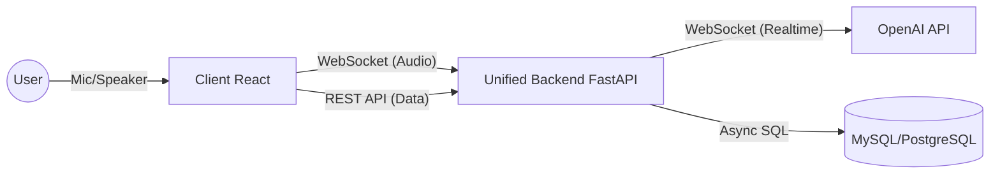

## 1. 프로젝트 정체성 (Identity)

- **서비스명:** 말랭이
    - *의미: 말하는 랭귀지,  반복하며 익히는 랭귀지*
- **슬로건:** "멈춤 없는 대화 속에서 원어민의 감각을 실시간으로 흡수하다."
- **핵심 가치:**
    1. **초저지연(Low-latency):** 0.5초 이내의 반응 속도로 실제 사람과 대화하는 듯한 몰입감.
    2. **실시간 피드백(Instant Feedback):** 대화 흐름을 끊지 않으면서 교정(Correction)과 팁을 제공.
    3. **단일 스택(Single Stack):** Python 통합으로 AI와 비즈니스 로직의 경계를 허물고 개발 속도 극대화.

---

## 2. 핵심 기술 전략: 왜 OpenAI Realtime API + Python인가?

### A. 기술 스택 통합 (Python Unification)

기존의 `Java(Biz) - Python(AI)` 분리 구조를 **FastAPI 단일 서버**로 통합합니다.

- **Zero Friction:** 데이터 전송을 위한 내부 API 통신이 사라져 지연 시간이 감소합니다.
- **Agility:** 팀원 전원이 Python 코드를 공유하여, AI 로직과 DB 저장 로직을 동시에 수정/배포할 수 있습니다.

### B. OpenAI Realtime API (WebSocket)

3주라는 짧은 기간 내 런칭을 위한 유일한 솔루션입니다.

- **올인원 워크플로우:** 듣기(STT) - 생각하기(LLM) - 말하기(TTS)가 단일 WebSocket 연결로 처리됩니다.
- **VAD 내장:** 발화 감지, 말 끊기(Interruption) 등 복잡한 음성 처리가 API 자체에 내장되어 있습니다.

---

## 3. 기능별 상세 구현 방안 (Technical Feasibility)

요청된 모든 기능은 **FastAPI + OpenAI API** 조합으로 100% 구현 가능합니다.

| 기능 항목 | 구현 가능 여부 | 핵심 구현 기술 및 파라미터 |
| --- | --- | --- |
| **자동 대화 감지 (VAD)** | ✅ 가능 | `turn_detection: { type: "server_vad" }` 설정. 별도 코드 없이 침묵을 감지해 자동 응답. |
| **실시간 텍스트 싱크** | ✅ 가능 | `response.audio_transcript.delta` 이벤트를 수신하여 음성과 동시에 텍스트 스트리밍. |
| **AI 목소리 선택** | ✅ 가능 | 세션 설정의 `voice` 파라미터(Alloy, Echo, Shimmer 등) 변경. |
| **사용자 속도 동기화** | ✅ 가능 | Python 서버에서 WPM 계산 → `session.update`의 `instructions`에 "Speak slower/faster" 지시어 주입. |
| **실시간 팁 (Dual LLM)** | ✅ 가능 | 사용자 발화 확정(`transcription.completed`) 즉시 `asyncio.create_task`로 **GPT-4o-mini**를 호출하여 팁 생성 (Main 대화 논블로킹). |
| **외계어/타언어 감지** | ✅ 가능 | STT 결과의 Confidence Score 확인 및 Python 로직으로 필터링. |
| **비주얼 Diff (시각화)** | ✅ 가능 | Python 표준 라이브러리 **`difflib`** 사용. 원문-교정문 차이를 계산하여 Front에 JSON 전송. |

---

## 4. 최종 시스템 아키텍처 (React + Python FastAPI)

복잡한 3티어 구조(React-Python-Java)를 **2티어 구조(React-Python)**로 단순화했습니다.

### 🏛️ 통합 구조도 (NCP 기반)



## 계층별 역할 및 핵심 미션

### Frontend: React

- **역할:** 사용자 인터페이스, 마이크 음성 캡처(Web Audio API), 오디오 재생.
- **핵심:** 오디오 데이터를 쪼개어(Chunking) WebSocket으로 지연 없이 전송.

### Backend: Python FastAPI (All-in-One)

- **역할:** AI 오케스트레이션(중계) 및 비즈니스 로직(DB 저장, 인증) 통합 수행.
- **핵심 기술:**
    - **Asyncio:** 수백 명의 동시 접속 대화를 단일 스레드 이벤트 루프로 처리.
    - **SQLAlchemy (Async):** 대화 도중 DB 저장이 발생해도 음성이 끊기지 않도록 비동기 DB 처리.
    - **Pydantic:** 데이터 유효성 검사 및 스키마 관리.

---

## 5. 3주 완성 집중 로드맵 (Execution Plan)

개발팀을 기능 단위(Squad)로 나누어 병렬 진행합니다. (언어가 같으므로 유연한 인력 이동 가능)

### 🚨 [0순위] 공통 선행 작업 (Day 1 ~ Day 2)

- [x]  **Git Repository:** `malang-monorepo` 또는 `frontend`, `backend` 생성.
- [ ]  **Backend Stack 확정:** Python 3.11+, FastAPI, Poetry(의존성 관리), SQLAlchemy(Async).
- [x]  **DB 세팅:** NCP(네이버클라우드)에 PostgreSQL(추천) 또는 MySQL 설치.
- [ ]  **API Key:** OpenAI Project API Key 발급 및 `.env` 공유.

### 📅 1주차: "Core Loop - 소리가 들리게 하라"

*목표: React에서 말하면 AI가 목소리로 대답하는 기본 루프 완성*

**Team A (AI Logic)**

- [ ]  `websockets` 라이브러리로 OpenAI Realtime API 연결 클래스 구현.
- [ ]  `/ws/chat` 엔드포인트 개설 및 오디오 스트림 양방향 중계 로직 작성.

**Team B (Client & Infra)**

- [ ]  React 프로젝트 스캐폴딩 (Vite) 및 마이크 권한 제어 훅(`useAudioRecorder`) 개발.
- [ ]  서버에서 받은 PCM 오디오 데이터를 브라우저에서 재생하는 `AudioWorklet` 또는 버퍼 로직 구현.

### 📅 2주차: "Intelligence - 지능을 더하고 기억하라"

*목표: 실시간 팁 생성 + 대화 내용 DB 저장 + 회원가입*

**Team A (AI Deep Dive)**

- [ ]  **VAD 튜닝:** `server_vad` 감도 조절로 말 끊기 자연스럽게 만들기.
- [ ]  **Dual LLM 파이프라인:** 메인 대화와 별도로 GPT-4o-mini를 비동기 호출하여 '팁' 생성 로직 구현.
- [ ]  **WPM 계산기:** 발화 속도 계산 알고리즘 적용.

**Team B (Platform Feature)**

- [ ]  **DB 스키마 설계:** `User`, `Session`, `MessageLog` 테이블 (SQLAlchemy Model).
- [ ]  **Auth:** JWT 기반 회원가입/로그인 API 구현.
- [ ]  **Logging:** Team A의 WebSocket 핸들러 내부에 대화 종료 시 `await db.save()` 훅 연동.

### 📅 3주차: "Visualization & Deploy - 보여주고 배포하라"

*목표: Diff 시각화, 대시보드 완성, 서비스 배포*

**Team A (Refinement)**

- [ ]  **Diff Engine:** Python `difflib` 활용하여 원문 vs 교정문 차이 분석 JSON 생성.
- [ ]  **Prompt Engineering:** AI 페르소나(친절한 선생님) 강화.

**Team B (Dashboard & DevOps)**

- [ ]  **Dashboard UI:** 학습 이력 리스트 및 Diff Viewer(React 라이브러리 활용) 구현.
- [ ]  **Deploy:** Dockerfile 작성 (Frontend, Backend) 및 NCP 서버 배포.
- [ ]  **Test:** 전체 시나리오 통합 테스트.

- 🐍 [개발팀 필독] Spring에서 FastAPI로 전환 시 알아야 할 5가지 핵심
    
    우리는 이번 **'말랑말랑'** 프로젝트의 빠른 런칭(3주)을 위해 기술 스택을 **Java/Spring**에서 **Python/FastAPI**로 전환합니다. 기존 Spring 개발자가 Python 환경에서 개발할 때 반드시 인지해야 할 **패러다임의 변화**를 정리했습니다.
    
    ---
    
    ## 1. 동시성 모델의 변화: "쓰레드 대신 이벤트 루프"
    
    가장 중요한 차이점입니다. 잘못 짜면 서버가 멈춥니다.
    
    ### ☕ Spring (Thread per Request)
    
    - **방식:** 요청이 올 때마다 쓰레드 풀에서 쓰레드를 하나 꺼내 할당합니다.
    - **특징:** DB 조회 등으로 쓰레드가 멈춰 있어도(Blocking), 다른 쓰레드가 일을 하므로 괜찮습니다.
    
    ### 🐍 FastAPI (Single Threaded Event Loop)
    
    - **방식:** **단 하나의 쓰레드(Main Thread)**가 무한 루프를 돌며 모든 요청을 처리합니다. (Node.js와 유사)
    - **핵심 규칙:** **"절대로 메인 쓰레드를 재우지 마라."**
        - DB 조회, 외부 API 호출 등 오래 걸리는 작업은 반드시 `await` 키워드를 붙여 비동기로 처리해야 합니다.
        - `await`를 만나면 서버는 "이거 기다리는 동안 다른 손님 받고 올게"라고 이동합니다.
    
    > ❌ 절대 금지 (Blocking Code)
    > 
    > 
    > ```python
    > import time
    > time.sleep(5)  # 서버 전체가 5초 동안 멈춤 (모든 사용자 먹통)
    > ```
    > 
    > **✅ 올바른 방법 (Non-blocking Code)**
    > 
    > ```python
    > import asyncio
    > await asyncio.sleep(5) # 이 요청만 5초 대기, 서버는 다른 요청 처리 중
    > ```
    > 
    
    ---
    
    ## 2. 타입 시스템: "컴파일 에러 대신 런타임 검증"
    
    Java는 컴파일 시점에 타입을 잡지만, Python은 코드가 실행될 때 타입을 확인합니다.
    
    ### ☕ Spring (Static Typing)
    
    - `int`, `String` 등 타입을 명시하지 않으면 컴파일 자체가 안 됩니다.
    - DTO 클래스에 Getter/Setter가 필수입니다.
    
    ### 🐍 FastAPI + Pydantic (Type Hints)
    
    - **Type Hints:** Python 3.10+부터는 `def func(a: int) -> str:` 처럼 타입을 명시하는 것이 표준입니다. (강제는 아니지만 우리 팀은 강제합니다.)
    - **Pydantic:** Java의 DTO 역할을 하는 라이브러리입니다.
        - 런타임에 데이터가 들어올 때 타입을 검사하고, 자동으로 형 변환(Casting)까지 해줍니다.
        - Getter/Setter 없이 필드명을 그대로 사용합니다.
    
    > 💻 코드 비교
    > 
    > 
    > ```python
    > # Pydantic 모델 (Java의 DTO)
    > class UserRequest(BaseModel):
    >     name: str
    >     age: int  # 문자열 "25"가 들어와도 자동으로 숫자 25로 변환됨
    > ```
    > 
    
    ---
    
    ## 3. 의존성 주입 (DI): "Annotation 마법 대신 명시적 주입"
    
    Spring 개발자가 가장 그리워하는 `@Autowired`는 없습니다. 하지만 더 직관적인 방법이 있습니다.
    
    ### ☕ Spring (IoC Container)
    
    - `@Service`, `@Component` 등을 붙여두면 스프링 컨테이너가 알아서 주입해줍니다. (Magic)
    
    ### 🐍 FastAPI (Dependency Injection)
    
    - **방식:** 함수 파라미터에 `Depends()`를 사용하여 의존성을 주입받습니다.
    - 어떤 함수가 실행되기 전에 필요한 부품(DB 세션, 인증 토큰)을 **함수의 인자**로 선언하면 FastAPI가 실행 시점에 넣어줍니다.
    
    > 💻 코드 비교
    > 
    > 
    > ```python
    > # Controller (Router)
    > @router.get("/users")
    > async def get_users(db: AsyncSession = Depends(get_db)): # 여기서 주입 발생!
    >     return await db.execute(...)
    > ```
    > 
    
    ---
    
    ## 4. 데이터베이스 처리: "JPA 대신 SQLAlchemy (Async)"
    
    ### ☕ JPA / Hibernate
    
    - 영속성 컨텍스트(1차 캐시), Dirty Checking, Lazy Loading 등 수많은 자동화 기능이 있습니다.
    
    ### 🐍 SQLAlchemy (Async)
    
    - **Explicit (명시적):** JPA만큼 마법을 부리지 않습니다. 쿼리를 좀 더 명시적으로 작성해야 합니다.
    - **Async 필수:** 우리는 비동기 서버이므로 DB 드라이버도 반드시 비동기용(`asyncpg`, `aiomysql`)을 써야 합니다.
    - **주의:** `lazy loading`은 비동기 환경에서 문제를 일으키기 쉬우므로, 데이터를 가져올 때 `joinedload` 등으로 한 번에 가져오는(Eager Loading) 전략을 주로 씁니다.
    
    ---
    
    ## 5. 요약: Spring 개발자가 버려야 할 습관 & 가져야 할 습관
    
    | 구분 | 🗑️ 버려야 할 습관 (Don'ts) | ✨ 가져야 할 습관 (Do's) |
    | --- | --- | --- |
    | **코드 스타일** | 모든 것을 클래스와 인터페이스로 만드려는 강박. | **함수형 프로그래밍**을 적극 활용. 파일 하나에 관련 로직을 모아도 됨. |
    | **변수명** | CamelCase (`userId`) | **SnakeCase** (`user_id`). 파이썬의 표준입니다. |
    | **동기 처리** | `Thread.sleep`, 동기식 HTTP Client (`RestTemplate`) | `await asyncio.sleep`, 비동기 Client (`httpx`) 사용 필수. |
    | **JSON 처리** | Jackson 라이브러리 설정 찾기 | **Pydantic**이 다 해줍니다. 모델만 잘 정의하세요. |
    | **어노테이션** | `@Service`, `@Bean` 남발 | 필요한 곳에만 데코레이터(`@router`) 사용. 로직은 순수 함수로 분리. |
    
    ---
    
    ### 🚀 한 줄 요약
    
    > "Spring보다 코드는 1/3로 줄어들고, 어노테이션 마법은 줄어듭니다. 하지만 async/await만 조심하면 개발 속도는 훨씬 빠릅니다."
    >